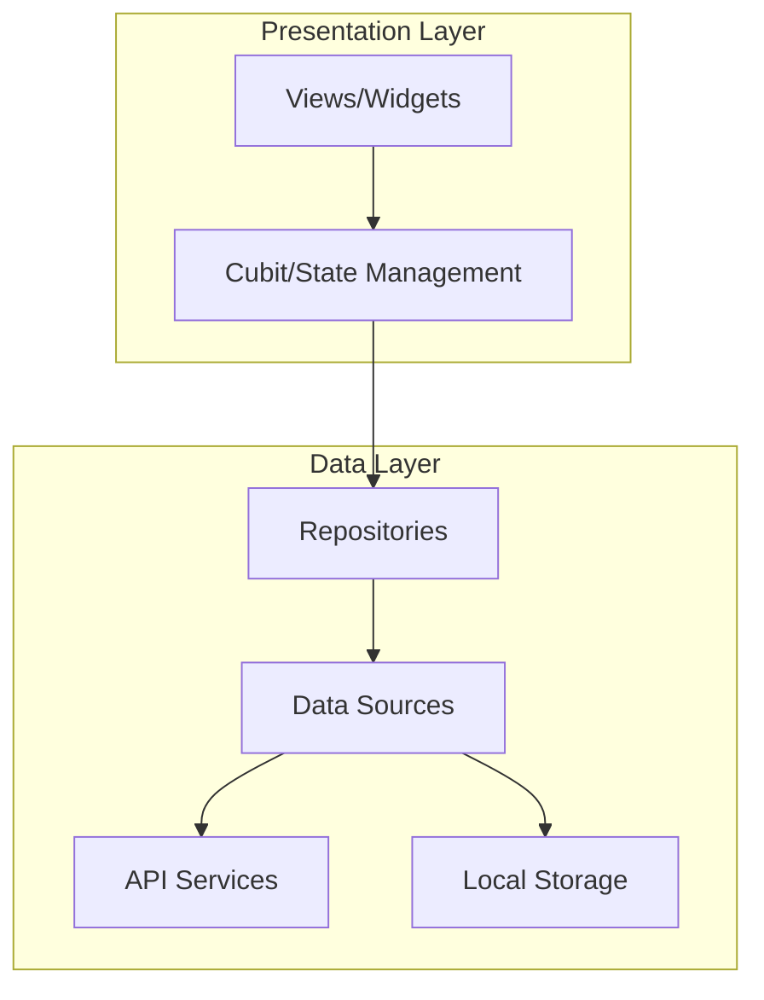
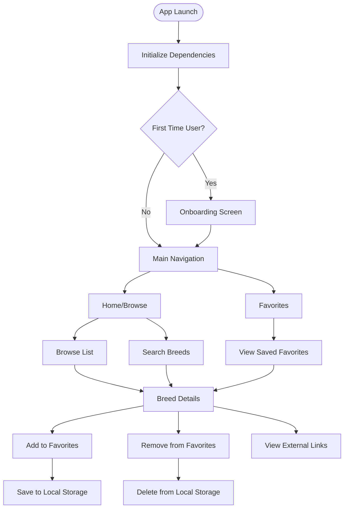
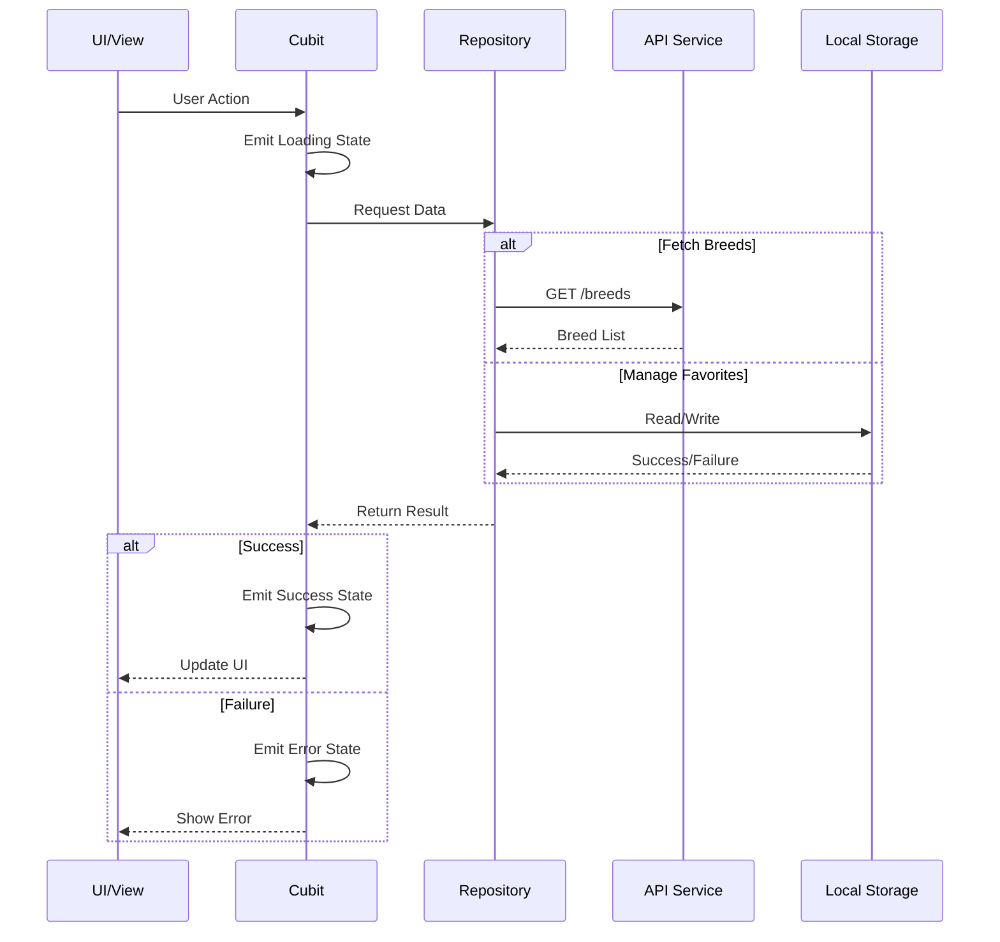
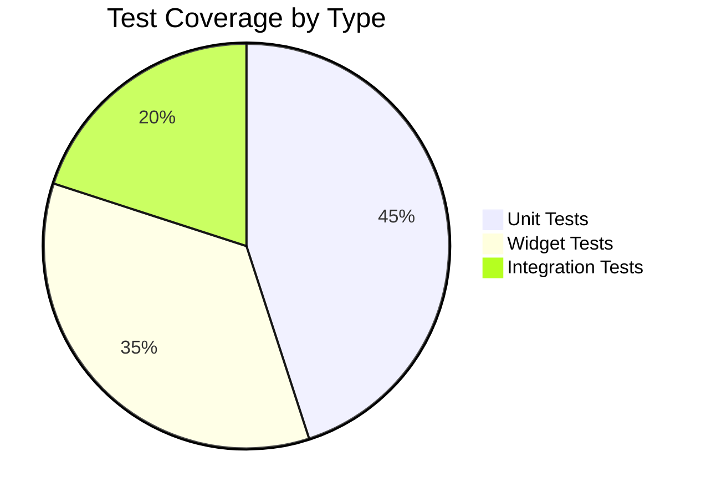
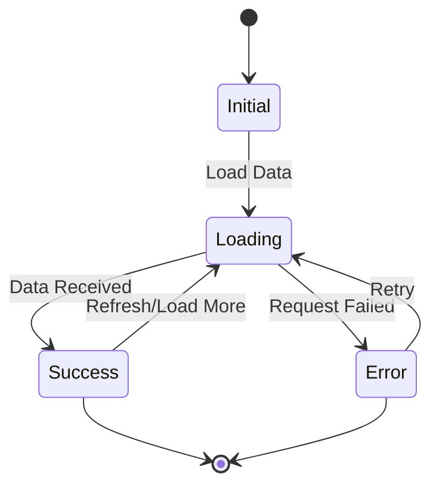
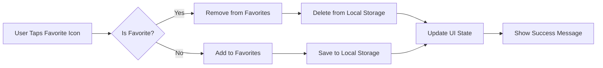
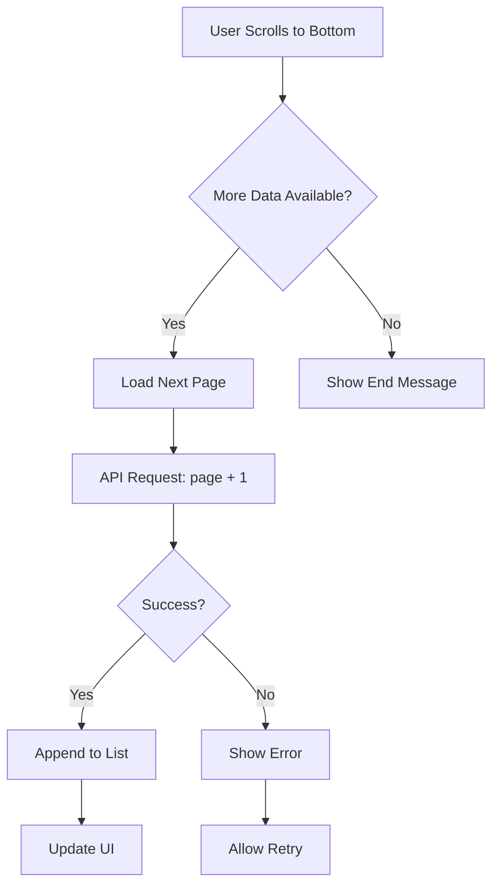

# Cat App 🐱

A modern Flutter application for browsing cat breeds, viewing detailed information, and managing your favorite cats. Built with clean architecture principles and BLoC state management.

## 📱 App Demo

Check out the app demo video here: [Watch Demo](https://drive.google.com/file/d/1GAvNs5wyBrunglWoRSsLSRWuiWMV0n9v/view?usp=drive_link)

## 🎯 Features

- **Onboarding Experience**: Welcome screen for first-time users
- **Browse Cat Breeds**: Explore various cat breeds with beautiful images
- **Search & Filter**: Find specific breeds easily
- **Breed Details**: View comprehensive information about each breed including:
  - Physical characteristics
  - Temperament
  - Origin and history
  - Alternative names
  - External links (Wikipedia, VetStreet, etc.)
- **Favorites Management**: Add/remove breeds to your favorites list
- **Pagination Support**: Efficient loading of breed data
- **Persistent Storage**: Favorites saved locally using secure storage

## 🏗️ Architecture

This app follows **Clean Architecture** principles with a feature-first folder structure:



## 🔄 App Flow

### User Navigation Flow



### Data Flow Architecture



## 🗂️ Project Structure

```
lib/
├── core/
│   ├── cache/              # Cache management
│   ├── constants/          # App constants (API, routes, etc.)
│   ├── di/                 # Dependency injection setup
│   ├── errors/             # Error handling & exceptions
│   ├── network/            # Network configuration
│   ├── routes/             # App routing
│   ├── utils/              # Utility functions
│   └── widgets/            # Shared widgets
├── features/
│   ├── favorites/
│   │   ├── data/
│   │   │   ├── datasources/    # Favorites API & local storage
│   │   │   ├── models/         # Favorite data models
│   │   │   └── repositories/   # Favorites repository
│   │   └── presentation/
│   │       ├── cubit/          # Favorites state management
│   │       ├── views/          # Favorites screens
│   │       └── widgets/        # Favorites UI components
│   ├── home/
│   │   ├── data/
│   │   │   ├── datasources/    # Home API service
│   │   │   ├── models/         # Breed models
│   │   │   └── repositories/   # Home repository
│   │   └── presentation/
│   │       ├── cubit/          # Home state management
│   │       ├── views/          # Home & detail screens
│   │       └── widgets/        # Home UI components
│   ├── main_navigation/        # Bottom navigation
│   └── onboarding/             # Onboarding screen
└── main.dart
```

## 🛠️ Tech Stack

### Core
- **Flutter SDK**: ^3.9.2
- **Dart**: ^3.9.2

### State Management
- **flutter_bloc**: ^9.1.1 - BLoC pattern implementation
- **equatable**: ^2.0.7 - Value equality

### Networking
- **dio**: ^5.9.0 - HTTP client
- **retrofit**: ^4.7.3 - Type-safe REST client
- **pretty_dio_logger**: ^1.4.0 - Network logging

### Storage
- **shared_preferences**: ^2.5.3 - Simple key-value storage
- **flutter_secure_storage**: ^9.2.4 - Secure storage for sensitive data

### Dependency Injection
- **get_it**: ^8.2.0 - Service locator

### UI
- **flutter_screenutil**: ^5.9.3 - Responsive UI
- **google_fonts**: ^6.3.2 - Custom fonts
- **flutter_native_splash**: ^2.4.6 - Native splash screen

### Utilities
- **dartz**: ^0.10.1 - Functional programming
- **json_annotation**: ^4.9.0 - JSON serialization

### Testing
- **flutter_test**: SDK - Widget & unit tests
- **integration_test**: SDK - Integration tests
- **bloc_test**: ^10.0.0 - BLoC testing utilities
- **mocktail**: ^1.0.4 - Mocking framework
- **mockito**: ^5.4.4 - Mock generation

## 🚀 Getting Started

### Prerequisites

- Flutter SDK (3.9.2 or higher)
- Dart SDK (3.9.2 or higher)
- Android Studio / VS Code
- iOS development tools (for iOS deployment)

### Installation

1. **Clone the repository**
   ```bash
   git clone <repository-url>
   cd cat_app
   ```

2. **Install dependencies**
   ```bash
   flutter pub get
   ```

3. **Generate code**
   ```bash
   flutter pub run build_runner build --delete-conflicting-outputs
   ```

4. **Run the app**
   ```bash
   flutter run
   ```

### Configuration

The app uses The Cat API for fetching breed data. The API configuration is set up in `lib/core/constants/api_constants.dart`.

## 🧪 Testing

The project includes comprehensive test coverage:

### Run All Tests
```bash
# Windows
test_runner.bat

# Linux/Mac
./test_runner.sh
```

### Run Specific Test Suites

**Unit Tests**
```bash
flutter test test/unit
```

**Widget Tests**
```bash
flutter test test/widget
```

**Integration Tests**
```bash
# Windows
run_integration_tests.bat

# Linux/Mac
./run_integration_tests.sh
```

### Test Coverage



The test suite covers:
- ✅ Unit tests for Cubits and Repositories
- ✅ Widget tests for UI components
- ✅ Integration tests for user flows
- ✅ Mock data and API responses

## 📋 State Management Flow



## 🎨 Key Features Flowcharts

### Favorites Feature



### Pagination Flow



## 📱 Screens

1. **Onboarding Screen**: First-time user welcome
2. **Home Screen**: Browse and search cat breeds
3. **Breed Details Screen**: Detailed information about a specific breed
4. **Favorites Screen**: View saved favorite breeds

## 🤝 Contributing

1. Fork the repository
2. Create a feature branch (`git checkout -b feature/amazing-feature`)
3. Commit your changes (`git commit -m 'Add amazing feature'`)
4. Push to the branch (`git push origin feature/amazing-feature`)
5. Open a Pull Request

## 📄 License

This project is licensed under the MIT License.

## 👨‍💻 Development

Built with ❤️ using Flutter and clean architecture principles.

---

For more detailed information about testing, see the [Testing Guide](TESTING_GUIDE.md).
